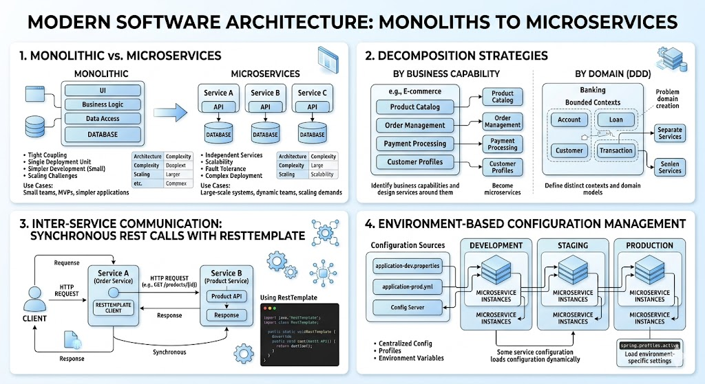

# [4.15] Microservices Architecture - Part 1

## Lesson Overview

## Dependencies

- [Self Studies](./studies.md) / [Lesson](./lesson.md) / [Assignment](./assignment.md) / [Slide Deck](./slides.md)

## Lesson Objectives

By the end of this lesson, students will be able to:

* **Explain** the difference between monolithic and microservices architectures and when to use each
* **Describe** how to decompose applications into microservices using business capability and domain strategies
* **Implement** inter-service communication using synchronous REST calls with RestTemplate
* **Apply** environment-based configuration management across multiple services

## Lesson Plan

| Duration | What | How or Why |
|---|---|---|
| 10 min | Warm-up | Recap Docker Compose and the `simple-crm` monolith — students will see their own project through a new architectural lens today |
| 20 min | Part 1: Monolithic Architecture | Walk through monolith characteristics, advantages, and disadvantages using the e-commerce and `simple-crm` examples; establish when monoliths are the right choice |
| 25 min | Part 2: Microservices Architecture | Introduce microservices — key characteristics, advantages, and disadvantages; compare at the same e-commerce example decomposed into services |
| 20 min | Part 3: Service Decomposition | Cover the 4 decomposition strategies; walk through the `simple-crm` decomposition example; explain Conway's Law and shared database anti-pattern |
| 15 min | Activity — Decompose a School Management System | Students independently decompose a given app into microservices on paper; share and discuss designs |
| 10 min | Break | — |
| 20 min | Part 4: RESTful Services in Microservices | Recap REST design principles in the context of microservices; walk through the RestTemplate inter-service communication example |
| 20 min | Part 5: Inter-Service Communication Patterns | Compare synchronous vs asynchronous communication; walk through code examples; discuss timeouts and retries |
| 15 min | Part 6: Configuration Management | Cover environment variables approach; walk through Docker Compose configuration example; discuss best practices |
| 10 min | Part 7: Microservices Challenges (Awareness) | Brief awareness overview of distributed tracing, centralized logging, data consistency, and testing complexity |
| 15 min | Wrap-up | Recap key concepts; preview Lesson 4.16 where students will build the actual microservices system |
| **180 min** | **Total** | |